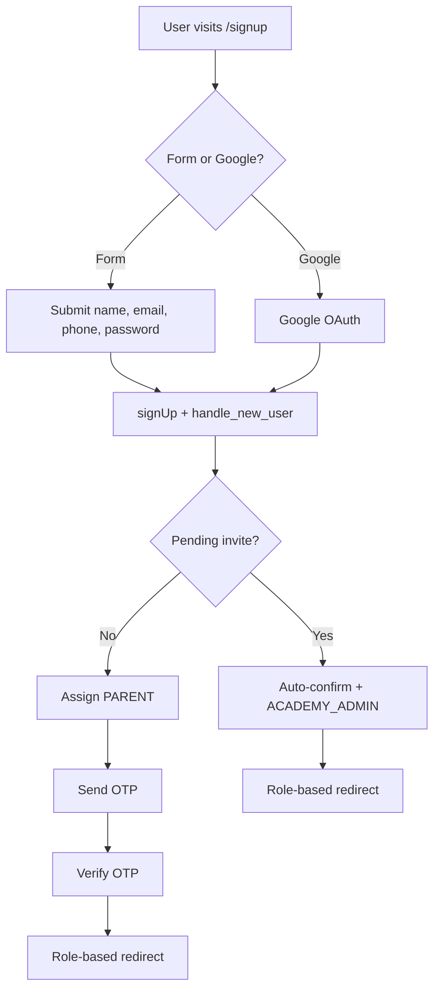
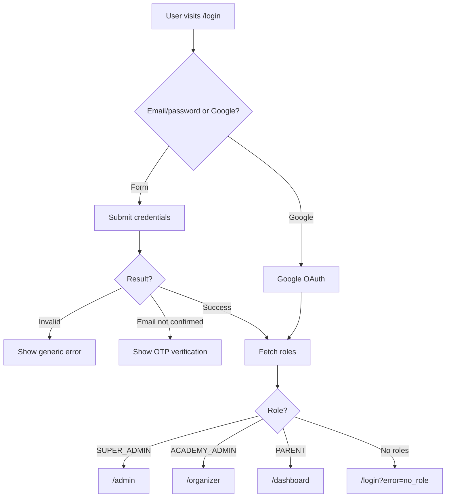
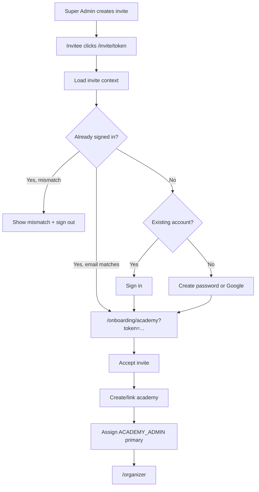
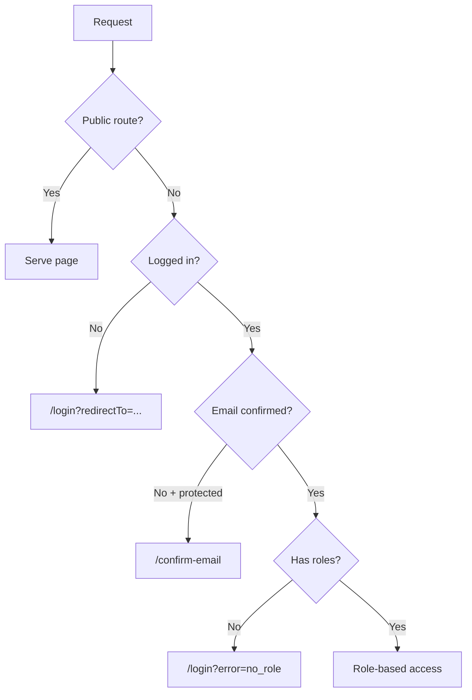

# Authentication - How It Works

Sprint 2 authentication system overview, aligned to the current implementation.

---

## User Stories

### 1. Parent Signup (Email)
A parent signs up with name, email, phone, and a strong password (12+ chars, mixed case, number, symbol). They see a 6‑digit verification code screen and confirm via OTP. After verification, they’re routed by role (PARENT → `/dashboard`).

**30-day sessions:** JWT expiry is 30 days; refresh token rotation keeps active users signed in.

### 2. Parent Signup/Login (Google)
A parent clicks “Continue with Google.” Google verifies the email and Supabase creates the profile. If there’s no pending invite, they get PARENT and land on `/dashboard`.

### 3. Parent Login
Email/password login shows a generic error on invalid credentials. If the email isn’t confirmed, the login flow switches to OTP verification. Successful login routes by role.

### 4. Academy Admin Invite
Invites are token-first. `/invite/[token]` shows invite context and lets the user sign in or create a password. Existing accounts default to “Sign in.” If already signed in with the invited email, they’re sent straight to onboarding. Accepting the invite creates/links the academy and makes `ACADEMY_ADMIN` the primary role.

---

## Auth Flows

### Signup Flow

### Login Flow

### Invite Flow (Token-First)

### Route Protection (Middleware)

Notes:
- `/checkout` is public and uses a UI modal gate.
- `/confirm-email` is public (OTP verification screen).

---

## Key Rules

| Rule | Description |
|------|-------------|
| **Default role** | New signups without an invite get PARENT |
| **Invite = verification** | Invited signups auto-confirm email |
| **Primary role** | Determines default dashboard; invite acceptance makes ACADEMY_ADMIN primary |
| **30-day sessions** | JWT expiry is 30 days; refresh tokens extend active sessions |
| **Email matching** | Invites can only be accepted by the invited email |
| **Role routing** | SUPER_ADMIN → /admin, ACADEMY_ADMIN → /organizer, PARENT → /dashboard |

---

## Onboarding Flags

Users have separate onboarding progress per role:

| Flag | Purpose |
|------|---------|
| `parent_onboarding_completed` | Parent onboarding progress |
| `academy_admin_onboarding_completed` | Academy admin onboarding progress |

`accept_invite()` resets `academy_admin_onboarding_completed` to `false`.

---

## Files (Current)

| Component | Path |
|-----------|------|
| Auth UI | `src/components/auth/auth-widget.tsx` |
| Auth modal | `src/components/auth/auth-modal.tsx` |
| Auth flow helper | `src/components/auth/use-auth-flow.ts` |
| Auth service wrapper | `src/services/auth-service.ts` |
| Auth callback | `src/app/(auth)/auth/callback/route.ts` |
| Middleware | `src/middleware.ts` |
| Invite page | `src/app/invite/[token]/page.tsx` |
| Academy onboarding | `src/app/onboarding/academy/page.tsx` |
| Invite context RPC | `supabase/migrations/20260108000000_auth_enhancements.sql` |
| Role assignment trigger | `supabase/migrations/20260108000000_auth_enhancements.sql` |
| Accept invite RPC | `supabase/migrations/20260108000000_auth_enhancements.sql` |
