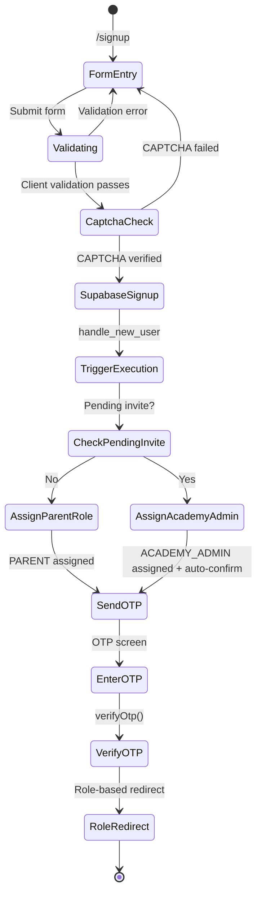
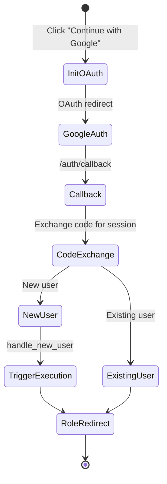
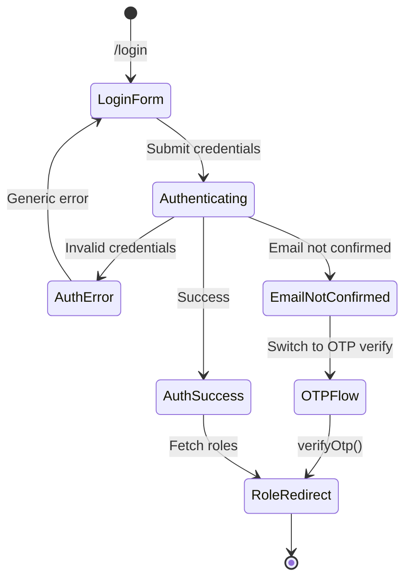
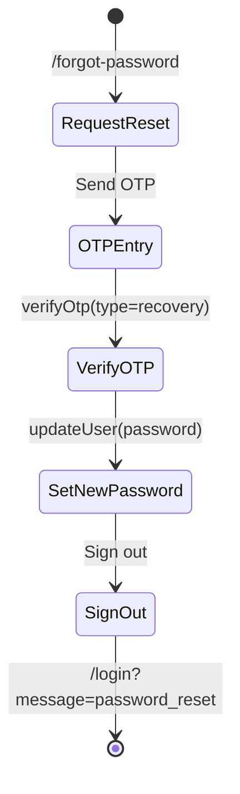
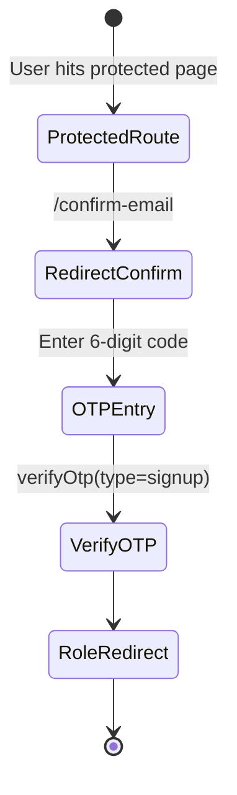
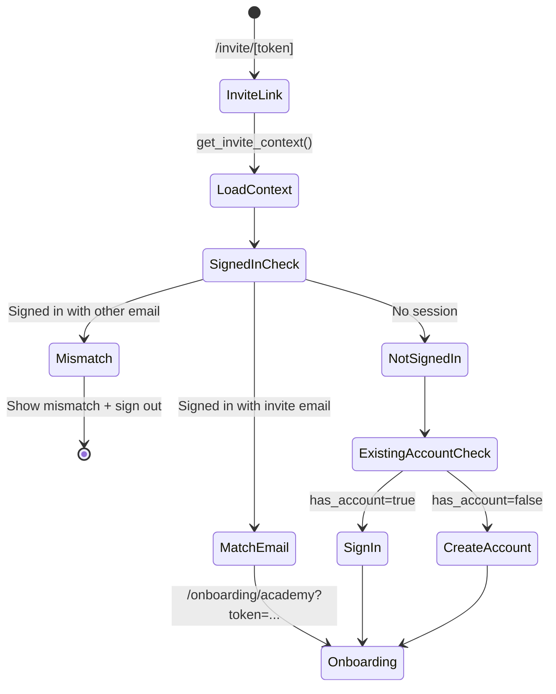
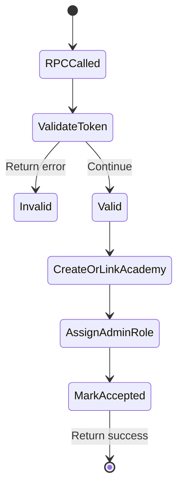
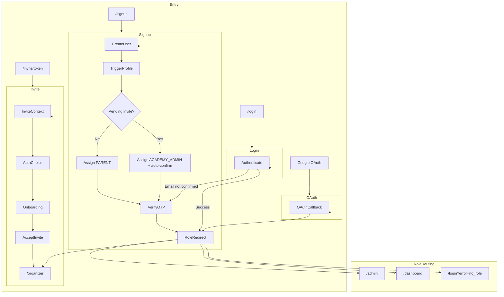

# Authentication System - Status Quo

This document reflects the current authentication and authorization system (verified against the live code and migrations).

---

## User Roles (Routing-Relevant)

| Role | Description | Primary Dashboard |
|------|-------------|-------------------|
| `PARENT` | Parents/guardians managing child athletes | `/dashboard` |
| `ACADEMY_ADMIN` | Academy admins (owners/managers/admins) | `/organizer` |
| `SUPER_ADMIN` | Platform superuser | `/admin` |

Other role labels may exist in data, but routing and middleware only enforce the three roles above.

---

## 1. Standard Email Signup Flow (Parent)

**Applies to:** `PARENT` (default role when no pending invite exists)

### What Happens
A user signs up with name, email, phone, and a strong password. If CAPTCHA is enabled, they must complete it. Supabase creates the account and `handle_new_user()` creates the profile. If there is a pending invite for the email, the user is auto‑confirmed and given `ACADEMY_ADMIN` immediately. Otherwise, they are assigned `PARENT`. All email/password signups require OTP verification; the UI stays on the OTP screen until the code is confirmed, then the user is redirected based on roles.

---

## 2. Google OAuth Flow

**Applies to:** All users

### What Happens
The user signs in with Google, which redirects through `/auth/callback`. For new users, `handle_new_user()` creates a profile from Google metadata. If a pending invite exists, `ACADEMY_ADMIN` is assigned; otherwise `PARENT` is assigned. The user is then redirected to the role-appropriate dashboard, or to an explicit `redirectTo` when provided (e.g., invite onboarding or checkout).

---

## 3. Standard Login Flow

**Applies to:** All users

### What Happens
The user submits email and password. Invalid credentials show a generic error. If the email is unconfirmed, the login view switches to OTP verification. Successful login triggers role-based redirects via `useAuthFlow`.

---

## 4. Password Reset Flow (OTP)

**Applies to:** All users

### What Happens
The user requests a reset. We always show a success message to prevent enumeration. The email contains a 6‑digit OTP; the UI verifies the code and then collects a new password. On success, the user is signed out and redirected to `/login?message=password_reset`.

---

## 5. Email Verification Flow (OTP)

**Applies to:** Unverified users

### What Happens
Protected routes (`/dashboard`, `/organizer`, `/admin`) require `email_confirmed_at`. If missing, middleware redirects to `/confirm-email`, which is an OTP verification screen. Once verified, the user is redirected by role.

---

## 6. Academy Admin Invite Flow (Token-First)

**Applies to:** `ACADEMY_ADMIN`

### What Happens
The invite link loads `/invite/[token]` and fetches invite context via RPC. Users can create a password, sign in, or continue with Google. Existing accounts default to “Sign in.” If the user is already signed in with the invited email, they are sent straight to onboarding. If signed in with a different email, they see a mismatch screen and must sign out.

---

## 7. Accept Invite RPC (Database-Side)

**What Happens**
`accept_invite()` validates the token, creates or links the academy, inserts `academy_admins`, demotes existing roles, sets `ACADEMY_ADMIN` as primary, and resets `academy_admin_onboarding_completed` to `false`.

---

## 8. Post-Invite Success Flow

After onboarding success, the user is redirected to `/organizer`. If they have no academy yet, the organizer page will redirect back to onboarding when a pending invite exists.

---

## 9. Route Protection (Middleware)

### Rules
- **Public routes:** `/`, `/camps`, `/login`, `/signup`, `/forgot-password`, `/reset-password`, `/confirm-email`, `/auth/*`, `/invite/*`, `/checkout`
- **Protected (email-confirmed):** `/dashboard`, `/organizer`, `/admin`
- **Auth required but unverified OK:** `/onboarding/*`

### Behavior
- Unauthenticated users are redirected to `/login?redirectTo=...` for protected routes.
- Unverified users are redirected to `/confirm-email` for protected routes.
- Users with no roles are sent to `/login?error=no_role`.
- Role-based gating enforces:
  - `SUPER_ADMIN` → `/admin`
  - `ACADEMY_ADMIN` → `/organizer`
  - `PARENT` → `/dashboard`

---

## 10. Session Management

- JWT expiry is 30 days (`jwt_expiry = 2592000`).
- Refresh token rotation keeps active users signed in.
- Protected pages include a client `SessionGuard` that re-checks sessions on mount and `pageshow` to prevent back/forward cache exposure after logout.

---

## 11. Sign Out Flow

- Sign out calls `/auth/signout` which clears the Supabase session and redirects to `/login`.
- `SessionGuard` prevents viewing cached protected content after logout.

---

## 12. Complete User Journey Overview

---

## Key Implementation Files

| Component | File Path |
|-----------|-----------|
| Auth widget | `src/components/auth/auth-widget.tsx` |
| Auth modal | `src/components/auth/auth-modal.tsx` |
| Auth flow helper | `src/components/auth/use-auth-flow.ts` |
| Auth service | `src/services/auth-service.ts` |
| Middleware | `src/middleware.ts` |
| Auth callback | `src/app/(auth)/auth/callback/route.ts` |
| Sign out | `src/app/(auth)/auth/signout/route.ts` |
| Invite page | `src/app/invite/[token]/page.tsx` |
| Academy onboarding | `src/app/onboarding/academy/page.tsx` |
| Invite context RPC | `supabase/migrations/20260108000000_auth_enhancements.sql` |
| Invite role assignment | `supabase/migrations/20260108000000_auth_enhancements.sql` |
| Accept invite RPC | `supabase/migrations/20260108000000_auth_enhancements.sql` |

---

## Security Features

- **CAPTCHA:** Cloudflare Turnstile on signup (feature-flagged)
- **Password strength:** 12+ chars with upper/lower/number/symbol
- **Email enumeration prevention:** Generic errors on login/reset
- **RLS:** Invites table protected by RLS policies
- **Invite verification:** Invites are single-use, must match email
- **Account linking:** Automatic linking for matching verified emails (Supabase dashboard setting)

---

## Onboarding Tracking

| Column | Purpose |
|--------|---------|
| `parent_onboarding_completed` | Parent onboarding progress |
| `academy_admin_onboarding_completed` | Academy admin onboarding progress |

`accept_invite()` resets `academy_admin_onboarding_completed` to `false` so invited admins complete onboarding even if they already onboarded as a parent.
