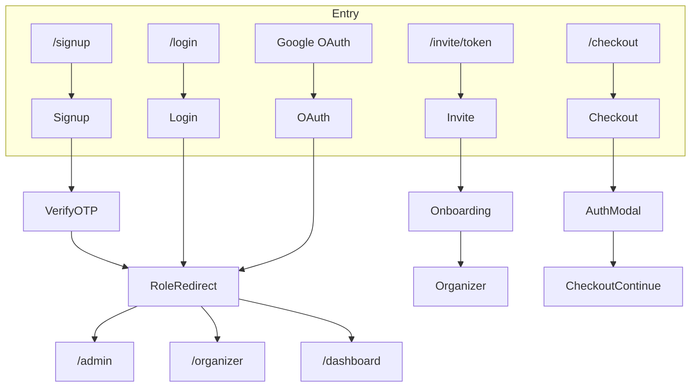

# Auth Guide

This guide explains the Tenpo authentication system from both product and engineering perspectives. It describes the user experience, flow diagrams, and the technical implementation (models, functions, routes, and middleware).

For deeper diagrams, see:
- `docs/sprints/sprint2/auth/auth-flow-high-level.md`
- `docs/sprints/sprint2/auth/auth-flow-low-level.md`

---

## Product Overview

### Core Goals
- One unified auth UI that can be embedded anywhere (static pages or modal).
- Clear, predictable flows for parents and academy admins.
- Invite-first onboarding for academy admins.
- OTP-based verification for signup and password reset.
- Role-based routing with minimal friction.

### User Stories

**Parent Signup (Email)**
- User creates an account on `/signup`.
- Receives a 6‑digit OTP and verifies in-app.
- Lands on `/dashboard` as `PARENT`.

**Parent Signup/Login (Google)**
- User signs in with Google.
- Profile is created from Google metadata.
- Lands on `/dashboard` if no invite exists.

**Parent Login**
- User logs in at `/login`.
- Invalid credentials show a generic error.
- Unconfirmed email triggers OTP verification.
- Redirects by role after success.

**Academy Admin Invite**
- Invitee opens `/invite/[token]` and sees invite context.
- Existing accounts default to sign-in; new users create a password or use Google.
- Invite acceptance creates/links academy and sets `ACADEMY_ADMIN` as primary.
- Redirects to `/organizer`.

**Checkout Auth (Mock)**
- `/checkout` is public and gated by a modal auth prompt.
- After auth, the modal closes and checkout continues.

---

## High-Level Flow Diagram

---

## Engineering Overview

### Key Components
- **`AuthWidget`** (`src/components/auth/auth-widget.tsx`)
  - Modes: `login`, `signup`, `verify-otp`, `reset-request`, `reset-password`, `invite`.
  - Contexts: `static`, `checkout`, `invite`.
  - Centralizes validation, OTP flow, error handling, and messaging.

- **`AuthModal`** (`src/components/auth/auth-modal.tsx`)
  - Wraps `AuthWidget` for modal experiences (checkout, blocking actions).

- **`useAuthFlow`** (`src/components/auth/use-auth-flow.ts`)
  - Role-based redirects or custom `returnTo` handling.

- **`auth-service`** (`src/services/auth-service.ts`)
  - Thin wrappers around Supabase auth calls.

- **`SessionGuard`** (`src/components/auth/session-guard.tsx`)
  - Re-checks session on mount and `pageshow` to prevent back/forward cache exposure after logout.

### Routes

**Public**
- `/`, `/camps`, `/login`, `/signup`, `/forgot-password`, `/reset-password`, `/confirm-email`, `/auth/*`, `/invite/*`, `/checkout`

**Protected (email-confirmed)**
- `/dashboard`, `/organizer`, `/admin`

**Auth required but unverified OK**
- `/onboarding/*`

### Middleware Rules (`src/middleware.ts`)
- If no session → redirect to `/login?redirectTo=...`.
- If email not confirmed on protected routes → `/confirm-email`.
- If no roles → `/login?error=no_role`.
- Role gating:
  - `SUPER_ADMIN` → `/admin`
  - `ACADEMY_ADMIN` → `/organizer`
  - `PARENT` → `/dashboard`

---

## Data Model & Database Logic

### Tables
- **`profiles`**: `id`, name fields, phone, avatar, onboarding flags.
- **`user_roles`**: `user_id`, `role`, `is_primary`.
- **`invites`**: `token`, `email`, `type`, `academy_id`, `created_by`, `expires_at`, `accepted_at`.
- **`academy_admins`**: links users to academies with role (`owner`, `admin`, `manager`).

### Triggers & RPCs

**`handle_new_user()`**
- Creates profile from metadata.
- If pending invite exists:
  - Auto-confirms email.
  - Assigns `ACADEMY_ADMIN` as primary.
- Else assigns `PARENT` as primary.

**`get_invite_context(token)`**
- Returns invite email, inviter name, type, and `has_account`.
- Used to render `/invite/[token]` before auth.

**`accept_invite(token, academy_name, academy_description)`**
- Validates token + email match.
- Creates academy for `academy_owner` invites or links for admin/manager.
- Demotes existing roles; sets `ACADEMY_ADMIN` as primary.
- Resets `academy_admin_onboarding_completed`.

---

## Verification & Security

- **OTP verification** for signup and password reset (6‑digit codes).
- **Invite emails** act as verification for invited admins.
- **CAPTCHA** (Turnstile) feature-flagged on signup.
- **RLS** protects invites; uses `auth.jwt() ->> 'email'` for email checks.
- **JWT expiry** is 30 days; refresh token rotation extends active sessions.

---

## UX & Modal Behavior

- **Inline auth** for `/login` and `/signup` pages.
- **Modal auth** for gated actions (checkout, future workflows).
- Modal blocks background interaction; closing cancels the action.
- On success, modal closes and flow continues (e.g., checkout).

---

## Quick File Index

| Area | File |
|------|------|
| Auth UI | `src/components/auth/auth-widget.tsx` |
| Modal wrapper | `src/components/auth/auth-modal.tsx` |
| Flow helper | `src/components/auth/use-auth-flow.ts` |
| Supabase wrappers | `src/services/auth-service.ts` |
| Auth callback | `src/app/(auth)/auth/callback/route.ts` |
| Invite page | `src/app/invite/[token]/page.tsx` |
| Onboarding | `src/app/onboarding/academy/page.tsx` |
| Middleware | `src/middleware.ts` |
| Invite context RPC | `supabase/migrations/20260108000000_auth_enhancements.sql` |
| Invite role assignment | `supabase/migrations/20260108000000_auth_enhancements.sql` |
| Accept invite RPC | `supabase/migrations/20260108000000_auth_enhancements.sql` |

---

## Testing References

Use `docs/sprints/sprint2/auth/updated-test-suite.md` for QA scenarios (signup/login/invite/reset/checkout).
