# DivineTime Database Schema Reference

This document provides a comprehensive analysis of the DivineTime production database schema. DivineTime is a sports training platform connecting parents with trainers for their children, featuring individual sessions, group events (camps, clinics), and subscription-based bulk session packages.

---

## System Overview

DivineTime is a **youth sports training marketplace** with three primary user roles:
- **Parents** - Book training sessions and events for their children
- **Trainers** - Offer training sessions and participate in events
- **Admins** - Manage the platform, events, and analytics

The platform supports:
1. **Individual Training Sessions** - One-on-one or small group sessions with trainers
2. **Events** - Camps, clinics, and networking events
3. **Bulk Session Packages** - Discounted session bundles
4. **Subscription Plans** - Recurring payment models via Stripe
5. **Payment Processing** - Full Stripe integration with refund handling

---

## Enum Types

```
UserRole: ADMIN | TRAINER | PARENT
EventType: CLINIC | CAMP | NETWORKING
SkillLevel: BEGINNER | INTERMEDIATE | ADVANCED
StatusEventRegistration: PENDING | PAID | CANCELED
StatusTicket: ACTIVE | CANCELED | REFUNDED | PENDING
StatusRefund: PENDING | APPROVED | REJECTED | COMPLETED
SubscriptionPlan: BASIC | FREE
SubscriptionStatus: ACTIVE | PAST_DUE | CANCELED | UNPAID | INCOMPLETE | INCOMPLETE_EXPIRED | TRIALING | PAUSED
NewsletterStatus: ACTIVE | UNSUBSCRIBED
```

---

## Core Entity Tables

### User
**Purpose**: Central authentication and identity table for all platform users.

| Column | Type | Description |
|--------|------|-------------|
| id | text (PK) | UUID identifier |
| email | text (unique) | Login email |
| first_name | text | User's first name |
| last_name | text | User's last name |
| phone_number | text | Contact number |
| password | text | Hashed password |
| role | UserRole | ADMIN, TRAINER, or PARENT |
| resetToken | text | Password reset token |
| resetTokenExpiresAt | timestamp | Token expiration |
| createdAt | timestamp | Record creation |
| updatedAt | timestamp | Last update |

**Relations**:
- Has one `Trainer` profile (if role=TRAINER)
- Has many `Child` records (if role=PARENT)
- Has one `Subscription`
- Has one `SessionBalance`
- Has many `Ticket`, `Payment`, `Refund`, `Email`, `EventSubscription`

---

### Trainer
**Purpose**: Extended profile for users with TRAINER role. Contains professional information and Stripe Connect details for payouts.

| Column | Type | Description |
|--------|------|-------------|
| user_id | text (PK, FK) | References User.id |
| first_name | text | Display name |
| last_name | text | Display name |
| bio | text | Professional biography |
| experience | text | Experience description |
| photos | text[] | Profile photo URLs |
| price_per_hour | integer | Hourly rate in cents |
| session_duration | integer | Default session length (minutes) |
| contacts | jsonb | Email and phone contact info |
| additionalSources | jsonb | Additional info array |
| external | boolean | External trainer flag |
| stripe_account_id | text | Stripe Connect account |
| stripe_onboarding_completed | boolean | Onboarding status |
| stripe_onboarding_url | text | Onboarding link |
| stripe_express_dashboard_url | text | Stripe dashboard URL |

**Relations**:
- Belongs to `User`
- Has many `Schedule` records
- Has many `Session` records
- Has many `EventTrainer` (events they're assigned to)
- Has many `Bulk` packages
- Has many `TrainerGroupDiscount` rates
- Has many `TrainerLocation` assignments

---

### Child
**Purpose**: Represents a child/player registered by a parent. Contains all information needed for training sessions and events including medical/safety information.

| Column | Type | Description |
|--------|------|-------------|
| id | text (PK) | UUID identifier |
| name | text | Full name (legacy) |
| first_name | text | First name |
| last_name | text | Last name |
| parent_id | text (FK) | References User.id |
| birthdate | timestamp | Date of birth |
| skill_level | text | Playing level |
| team | text | Current team name |
| specify | text | Additional level details |
| allergies | text[] | Known allergens |
| emergency_contact | jsonb | Emergency contact details |
| medical_conditions | jsonb | Medical info (asthma, other) |

**Relations**:
- Belongs to `User` (parent)
- Has many `CustomAllergen` records
- Has many `Session` records
- Has many `ScheduleBooking` records
- Has many `EventRegistration` records
- Has many `Ticket` records
- Has many `UserTicket` records

---

### CustomAllergen
**Purpose**: Stores custom allergens not in the predefined list for a child.

| Column | Type | Description |
|--------|------|-------------|
| id | text (PK) | UUID identifier |
| name | text | Allergen name |
| child_id | text (FK) | References Child.id |

---

## Location & Scheduling Tables

### Location
**Purpose**: Physical venues where training sessions and events take place.

| Column | Type | Description |
|--------|------|-------------|
| id | text (PK) | UUID identifier |
| name | text | Location name |

**Relations**:
- Has many `Event` records
- Has many `Trainer` records (via TrainerLocation)
- Has many `Session` records
- Has many `Slot` records

---

### TrainerLocation
**Purpose**: Many-to-many join table linking trainers to their available locations.

| Column | Type | Description |
|--------|------|-------------|
| trainer_id | text (FK) | References Trainer.user_id |
| location_id | text (FK) | References Location.id |

---

### Schedule
**Purpose**: A trainer's availability window for booking sessions.

| Column | Type | Description |
|--------|------|-------------|
| id | text (PK) | UUID identifier |
| trainer_id | text (FK) | References Trainer.user_id |
| start_date | timestamp | Availability start |
| end_date | timestamp | Availability end |

**Relations**:
- Belongs to `Trainer`
- Has many `Slot` records
- Has many `ScheduleBooking` records

---

### Slot
**Purpose**: Individual time slots within a schedule that can be booked.

| Column | Type | Description |
|--------|------|-------------|
| id | text (PK) | UUID identifier |
| schedule_id | text (FK) | References Schedule.id |
| locationId | text (FK) | References Location.id |
| start | text | Start time |
| end | text | End time |
| is_booked | boolean | Booking status |
| is_deleted | boolean | Soft delete flag |

---

### ScheduleBooking
**Purpose**: Records when a parent books a slot for their child.

| Column | Type | Description |
|--------|------|-------------|
| id | text (PK) | UUID identifier |
| schedule_id | text (FK) | References Schedule.id |
| child_id | text (FK) | References Child.id |
| slot_id | text (FK) | References Slot.id |

**Relations**:
- Belongs to `Schedule`
- Belongs to `Child`
- Has one `Slot`
- Has one `Session`

---

## Session Tables

### Session
**Purpose**: A confirmed training session between a trainer and child(ren).

| Column | Type | Description |
|--------|------|-------------|
| id | text (PK) | UUID identifier |
| trainer_id | text (FK) | References Trainer.user_id |
| child_id | text (FK) | Primary child |
| parent_id | text | Parent user ID |
| booking_id | text (FK) | References ScheduleBooking.id |
| location_id | text (FK) | References Location.id |
| date | timestamp | Session date/time |
| status | StatusEventRegistration | PENDING, PAID, CANCELED |
| group_session | boolean | Multiple children flag |
| main_child_id | text | Primary child for group |
| totalPrice | integer | Total price in cents |
| google_event_id | text | Google Calendar event ID |

**Relations**:
- Belongs to `Trainer`
- Belongs to `Child`
- Belongs to `Location`
- Belongs to `ScheduleBooking`
- Has one `SessionDetails`

---

### SessionDetails
**Purpose**: Tracks session consumption from bulk packages or balances.

| Column | Type | Description |
|--------|------|-------------|
| id | text (PK) | UUID identifier |
| session_id | text (FK) | References Session.id |
| sessions_used | integer | Sessions consumed |
| sessions_remaining | integer | Remaining balance |
| withBalance | boolean | Used session balance |

**Relations**:
- Belongs to `Session`
- Has many `SessionParticipant` records

---

### SessionParticipant
**Purpose**: Tracks additional children in a group session.

| Column | Type | Description |
|--------|------|-------------|
| id | text (PK) | UUID identifier |
| session_detail_id | text (FK) | References SessionDetails.id |
| child_id | text (FK) | References Child.id |

---

### SessionBalance
**Purpose**: Tracks a user's prepaid session credits.

| Column | Type | Description |
|--------|------|-------------|
| id | text (PK) | UUID identifier |
| userId | text (FK, unique) | References User.id |
| amount | integer | Available session credits |

---

## Bulk Package Tables

### Bulk
**Purpose**: Trainer-defined bulk session packages with volume discounts.

| Column | Type | Description |
|--------|------|-------------|
| id | text (PK) | UUID identifier |
| trainer_id | text (FK) | References Trainer.user_id |
| price | integer | Total package price (cents) |
| number_of_sessions | integer | Sessions included |

**Example**: 10 sessions for $800 (normally $100/session = $1000)

---

### UserBulk
**Purpose**: Records when a user purchases a bulk package.

| Column | Type | Description |
|--------|------|-------------|
| id | text (PK) | UUID identifier |
| userId | text (FK) | References User.id |
| bulkId | text (FK) | References Bulk.id |
| trainer_id | text (FK) | References Trainer.user_id |
| number_of_sessions | integer | Remaining sessions |

---

### TrainerGroupDiscount
**Purpose**: Trainer-defined group session pricing.

| Column | Type | Description |
|--------|------|-------------|
| id | text (PK) | UUID identifier |
| trainer_id | text (FK) | References Trainer.user_id |
| participants | integer | Number of children |
| price | integer | Total price for group |

---

## Event Tables

### Event
**Purpose**: Camps, clinics, and networking events.

| Column | Type | Description |
|--------|------|-------------|
| id | text (PK) | UUID identifier |
| title | text | Event name |
| description | text | Full description |
| eventType | EventType | CLINIC, CAMP, NETWORKING |
| location_id | text (FK) | References Location.id |
| start_date | timestamp | Event start |
| end_date | timestamp | Event end |
| start_time | text | Daily start time |
| end_time | text | Daily end time |
| price | decimal | Base price |
| max_participants | integer | Capacity limit |
| min_age | integer | Minimum age |
| max_age | integer | Maximum age |
| skillLevels | SkillLevel[] | Allowed skill levels |
| documents | text[] | Waiver/document URLs |
| image | text | Event image URL |
| canceled | boolean | Cancellation flag |

**Relations**:
- Belongs to `Location`
- Has many `EventTrainer` (assigned trainers)
- Has many `EventTicket` (ticket types)
- Has many `EventRegistration` records
- Has many `Ticket` records
- Has many `EventSubscription` (notifications)

---

### EventTrainer
**Purpose**: Many-to-many linking trainers to events they're coaching.

| Column | Type | Description |
|--------|------|-------------|
| event_id | text (FK) | References Event.id |
| trainer_id | text (FK) | References Trainer.user_id |

**Composite PK**: (event_id, trainer_id)

---

### EventTicket
**Purpose**: Ticket types/tiers for an event (e.g., "Early Bird", "VIP").

| Column | Type | Description |
|--------|------|-------------|
| id | text (PK) | UUID identifier |
| event_id | text (FK) | References Event.id |
| type | text | Ticket type name |
| price | decimal | Ticket price |
| capacity | integer | Available quantity |
| total_amount | integer | Tickets sold |
| deleted | boolean | Soft delete flag |

**Unique Constraint**: (event_id, type)

---

### EventRegistration
**Purpose**: Records child registration for an event.

| Column | Type | Description |
|--------|------|-------------|
| id | text (PK) | UUID identifier |
| event_id | text (FK) | References Event.id |
| child_id | text (FK) | References Child.id |
| status | StatusEventRegistration | PENDING, PAID, CANCELED |

---

### EventSubscription
**Purpose**: Email notification subscriptions for event updates.

| Column | Type | Description |
|--------|------|-------------|
| id | text (PK) | UUID identifier |
| userId | text (FK) | References User.id |
| eventId | text (FK) | References Event.id |
| email | text | Notification email |
| status | NewsletterStatus | ACTIVE, UNSUBSCRIBED |
| unsubscribeToken | text (unique) | Unsubscribe link token |

**Unique Constraint**: (userId, eventId)

---

## Ticketing & Payment Tables

### Ticket
**Purpose**: A purchased ticket for an event.

| Column | Type | Description |
|--------|------|-------------|
| id | text (PK) | UUID identifier |
| user_id | text (FK) | References User.id |
| event_id | text (FK) | References Event.id |
| child_id | text (FK) | References Child.id |
| price | decimal | Purchase price |
| type | text | Ticket type |
| capacity | integer | Quantity |
| status | StatusTicket | ACTIVE, CANCELED, REFUNDED, PENDING |
| stripe_payment_id | text | Stripe payment reference |

**Relations**:
- Belongs to `User`, `Event`, `Child`
- Has many `UserTicket` records
- Has one `Refund`

---

### UserTicket
**Purpose**: Individual ticket assignments (supports multiple children per purchase).

| Column | Type | Description |
|--------|------|-------------|
| id | text (PK) | CUID identifier |
| user_id | text (FK) | References User.id |
| ticket_id | text (FK) | References Ticket.id |
| event_ticket_id | text | EventTicket reference |
| child_id | text (FK) | References Child.id |
| status | text | Ticket status |
| refund_id | text (FK) | References Refund.id |

---

### Payment
**Purpose**: Payment records for event ticket purchases.

| Column | Type | Description |
|--------|------|-------------|
| id | text (PK) | UUID identifier |
| user_id | text (FK) | References User.id |
| event_id | text | Event reference |
| event_ticket_id | text | Ticket type reference |
| stripe_payment_id | text | Stripe payment ID |
| amount | decimal | Payment amount |
| currency | text | Currency code |
| status | text | Payment status |
| payment_method | text | Method used |
| email | text | Receipt email |

---

### TrainerOrder
**Purpose**: Payment records for trainer session purchases.

| Column | Type | Description |
|--------|------|-------------|
| id | text (PK) | UUID identifier |
| user_id | text (FK) | References User.id |
| trainer_id | text (FK) | References Trainer.user_id |
| stripe_payment_id | text | Stripe payment ID |
| amount | decimal | Payment amount |
| currency | text | Currency code |
| status | text | Payment status |
| payment_method | text | Method used |

---

### Refund
**Purpose**: Refund requests for ticket purchases.

| Column | Type | Description |
|--------|------|-------------|
| id | text (PK) | UUID identifier |
| ticket_id | text (FK, unique) | References Ticket.id |
| user_id | text (FK) | References User.id |
| amount | text | Refund amount |
| status | StatusRefund | PENDING, APPROVED, REJECTED, COMPLETED |
| stripe_payment_id | text | Original payment reference |
| reason | text | Refund reason |

---

## Subscription Tables

### Subscription
**Purpose**: User subscription for platform access via Stripe.

| Column | Type | Description |
|--------|------|-------------|
| id | text (PK) | UUID identifier |
| userId | text (FK, unique) | References User.id |
| stripeCustomerId | text (unique) | Stripe customer ID |
| stripeSubscriptionId | text (unique) | Stripe subscription ID |
| stripePriceId | text | Price plan ID |
| plan | SubscriptionPlan | BASIC, FREE |
| status | SubscriptionStatus | Subscription state |
| currentPeriodStart | timestamp | Billing period start |
| currentPeriodEnd | timestamp | Billing period end |
| cancelAtPeriodEnd | boolean | Scheduled cancellation |

---

## Analytics Tables

### DailyStatistics
**Purpose**: Daily platform metrics snapshot.

| Column | Type | Description |
|--------|------|-------------|
| id | text (PK) | UUID identifier |
| date | timestamp | Snapshot date |
| dailyRevenue | decimal | Revenue for day |
| dailyUsers | integer | Active users |
| dailySignups | integer | New registrations |
| dailySessions | integer | Sessions conducted |
| dailyPayments | integer | Payments processed |
| totalUsers | integer | Cumulative users |
| totalTrainers | integer | Cumulative trainers |
| totalRevenue | decimal | Cumulative revenue |

---

### MonthlyStatistics
**Purpose**: Monthly aggregated metrics.

| Column | Type | Description |
|--------|------|-------------|
| id | text (PK) | UUID identifier |
| year | integer | Year |
| month | integer | Month (1-12) |
| totalRevenue | decimal | Monthly total |
| eventRevenue | decimal | From events |
| sessionRevenue | decimal | From sessions |
| subscriptionRevenue | decimal | From subscriptions |
| newUsers | integer | New users |
| totalUsers | integer | Total users |
| activeUsers | integer | Active users |
| newTrainers | integer | New trainers |
| totalTrainers | integer | Total trainers |
| activeTrainers | integer | Active trainers |
| newSubscriptions | integer | New subs |
| totalSubscriptions | integer | Total subs |
| activeSubscriptions | integer | Active subs |
| canceledSubscriptions | integer | Cancellations |
| totalEvents | integer | Events created |
| completedEvents | integer | Events finished |
| canceledEvents | integer | Events canceled |
| totalSessions | integer | Sessions created |
| completedSessions | integer | Sessions completed |
| totalPayments | integer | Payments processed |
| successfulPayments | integer | Successful payments |
| failedPayments | integer | Failed payments |

---

### YearlyStatistics
**Purpose**: Annual aggregated metrics (same structure as Monthly).

---

## System Tables

### Order
**Purpose**: Generic order tracking (legacy/minimal use).

| Column | Type | Description |
|--------|------|-------------|
| id | text (PK) | UUID identifier |
| customer_id | text | Customer reference |
| product_id | text | Product reference |
| price | integer | Order price |

---

### Email
**Purpose**: Email communication log.

| Column | Type | Description |
|--------|------|-------------|
| id | text (PK) | UUID identifier |
| user_id | text (FK) | References User.id |
| subject | text | Email subject |
| body | text | Email content |
| status | text | Delivery status |

---

### Verification
**Purpose**: OTP verification for email/phone.

| Column | Type | Description |
|--------|------|-------------|
| id | text (PK) | UUID identifier |
| userId | text (FK, unique) | References User.id |
| otp | text | One-time password |
| expiresAt | timestamp | Expiration time |

---

### Otp
**Purpose**: Secondary OTP table (possibly for different verification flows).

| Column | Type | Description |
|--------|------|-------------|
| id | text (PK) | UUID identifier |
| userId | text (FK) | References User.id |
| otp | text | One-time password |
| expiresAt | timestamp | Expiration time |

---

### google_calendar_integrations
**Purpose**: Google Calendar OAuth tokens for trainers.

| Column | Type | Description |
|--------|------|-------------|
| id | text (PK) | UUID identifier |
| userId | text (FK) | References User.id |
| email | text | Google account email |
| accessToken | text | OAuth access token |
| refreshToken | text | OAuth refresh token |
| expiryDate | timestamp | Token expiration |
| isActive | boolean | Integration status |

---

## Entity Relationship Diagram

```mermaid
erDiagram
    %% ===== CORE ENTITIES =====
    User {
        text id PK
        text email UK
        text first_name
        text last_name
        text phone_number
        text password
        UserRole role
        timestamp createdAt
        timestamp updatedAt
    }

    Trainer {
        text user_id PK,FK
        text first_name
        text last_name
        text bio
        text experience
        int price_per_hour
        int session_duration
        text stripe_account_id
        bool stripe_onboarding_completed
    }

    Child {
        text id PK
        text parent_id FK
        text first_name
        text last_name
        text skill_level
        text team
        timestamp birthdate
        text[] allergies
        jsonb emergency_contact
        jsonb medical_conditions
    }

    Location {
        text id PK
        text name
    }

    %% ===== SCHEDULING =====
    Schedule {
        text id PK
        text trainer_id FK
        timestamp start_date
        timestamp end_date
    }

    Slot {
        text id PK
        text schedule_id FK
        text locationId FK
        text start
        text end
        bool is_booked
        bool is_deleted
    }

    ScheduleBooking {
        text id PK
        text schedule_id FK
        text child_id FK
        text slot_id FK
    }

    %% ===== SESSIONS =====
    Session {
        text id PK
        text trainer_id FK
        text child_id FK
        text parent_id
        text booking_id FK
        text location_id FK
        timestamp date
        StatusEventRegistration status
        bool group_session
        int totalPrice
    }

    SessionDetails {
        text id PK
        text session_id FK
        int sessions_used
        int sessions_remaining
        bool withBalance
    }

    SessionParticipant {
        text id PK
        text session_detail_id FK
        text child_id FK
    }

    SessionBalance {
        text id PK
        text userId FK,UK
        int amount
    }

    %% ===== EVENTS =====
    Event {
        text id PK
        text title
        text description
        EventType eventType
        text location_id FK
        timestamp start_date
        timestamp end_date
        decimal price
        int max_participants
        int min_age
        int max_age
        bool canceled
    }

    EventTrainer {
        text event_id PK,FK
        text trainer_id PK,FK
    }

    EventTicket {
        text id PK
        text event_id FK
        text type
        decimal price
        int capacity
        int total_amount
        bool deleted
    }

    EventRegistration {
        text id PK
        text event_id FK
        text child_id FK
        StatusEventRegistration status
    }

    EventSubscription {
        text id PK
        text userId FK
        text eventId FK
        text email
        NewsletterStatus status
        text unsubscribeToken UK
    }

    %% ===== TICKETING & PAYMENTS =====
    Ticket {
        text id PK
        text user_id FK
        text event_id FK
        text child_id FK
        decimal price
        text type
        StatusTicket status
        text stripe_payment_id
    }

    UserTicket {
        text id PK
        text user_id FK
        text ticket_id FK
        text event_ticket_id
        text child_id FK
        text status
        text refund_id FK
    }

    Payment {
        text id PK
        text user_id FK
        text event_id
        text event_ticket_id
        text stripe_payment_id
        decimal amount
        text currency
        text status
    }

    TrainerOrder {
        text id PK
        text user_id FK
        text trainer_id FK
        text stripe_payment_id
        decimal amount
        text currency
        text status
    }

    Refund {
        text id PK
        text ticket_id FK,UK
        text user_id FK
        text amount
        StatusRefund status
        text stripe_payment_id
        text reason
    }

    %% ===== BULK PACKAGES =====
    Bulk {
        text id PK
        text trainer_id FK
        int price
        int number_of_sessions
    }

    UserBulk {
        text id PK
        text userId FK
        text bulkId FK
        text trainer_id FK
        int number_of_sessions
    }

    TrainerGroupDiscount {
        text id PK
        text trainer_id FK
        int participants
        int price
    }

    %% ===== SUBSCRIPTIONS =====
    Subscription {
        text id PK
        text userId FK,UK
        text stripeCustomerId UK
        text stripeSubscriptionId UK
        SubscriptionPlan plan
        SubscriptionStatus status
        timestamp currentPeriodStart
        timestamp currentPeriodEnd
        bool cancelAtPeriodEnd
    }

    %% ===== SUPPORT TABLES =====
    CustomAllergen {
        text id PK
        text child_id FK
        text name
    }

    Verification {
        text id PK
        text userId FK,UK
        text otp
        timestamp expiresAt
    }

    Email {
        text id PK
        text user_id FK
        text subject
        text body
        text status
    }

    google_calendar_integrations {
        text id PK
        text userId FK
        text email
        text accessToken
        text refreshToken
        bool isActive
    }

    %% ===== RELATIONSHIPS =====

    %% User relationships
    User ||--o| Trainer : "is"
    User ||--o{ Child : "has"
    User ||--o| Subscription : "has"
    User ||--o| SessionBalance : "has"
    User ||--o| Verification : "has"
    User ||--o{ Email : "receives"
    User ||--o{ Payment : "makes"
    User ||--o{ Ticket : "purchases"
    User ||--o{ UserTicket : "holds"
    User ||--o{ Refund : "requests"
    User ||--o{ EventSubscription : "subscribes"
    User ||--o{ TrainerOrder : "places"
    User ||--o{ UserBulk : "owns"
    User ||--o| google_calendar_integrations : "connects"

    %% Trainer relationships
    Trainer ||--o{ Schedule : "sets"
    Trainer ||--o{ Session : "conducts"
    Trainer ||--o{ EventTrainer : "assigned"
    Trainer ||--o{ Bulk : "offers"
    Trainer ||--o{ TrainerGroupDiscount : "defines"
    Trainer ||--o{ TrainerOrder : "receives"

    %% Child relationships
    Child ||--o{ CustomAllergen : "has"
    Child ||--o{ Session : "attends"
    Child ||--o{ ScheduleBooking : "books"
    Child ||--o{ EventRegistration : "registers"
    Child ||--o{ Ticket : "assigned"
    Child ||--o{ UserTicket : "uses"
    Child ||--o{ SessionParticipant : "participates"

    %% Location relationships
    Location ||--o{ Event : "hosts"
    Location ||--o{ Session : "at"
    Location ||--o{ Slot : "available"

    %% Schedule/Booking relationships
    Schedule ||--o{ Slot : "contains"
    Schedule ||--o{ ScheduleBooking : "receives"
    ScheduleBooking ||--o| Slot : "reserves"
    ScheduleBooking ||--o| Session : "creates"

    %% Session relationships
    Session ||--o| SessionDetails : "has"
    SessionDetails ||--o{ SessionParticipant : "includes"

    %% Event relationships
    Event ||--o{ EventTrainer : "staffed"
    Event ||--o{ EventTicket : "sells"
    Event ||--o{ EventRegistration : "receives"
    Event ||--o{ Ticket : "generates"
    Event ||--o{ EventSubscription : "notifies"

    %% Ticket/Payment relationships
    Ticket ||--o{ UserTicket : "distributed"
    Ticket ||--o| Refund : "refunded"
    UserTicket }o--o| Refund : "linked"

    %% Bulk relationships
    Bulk ||--o{ UserBulk : "purchased"
```



### Simplified Domain View


---

## Key Business Flows

### 1. Session Booking Flow
1. Parent browses available trainers
2. Views trainer's `Schedule` and available `Slot` records
3. Creates `ScheduleBooking` linking child to slot
4. `Session` record created with status=PENDING
5. Payment processed via `TrainerOrder`
6. Session status updated to PAID
7. `SessionDetails` tracks if bulk package used

### 2. Event Registration Flow
1. Parent browses `Event` listings
2. Views `EventTicket` types/pricing
3. Selects ticket type and child
4. `Payment` processed via Stripe
5. `Ticket` created with status=ACTIVE
6. `UserTicket` created for each child
7. `EventRegistration` created with status=PAID

### 3. Bulk Package Purchase
1. Parent views trainer's `Bulk` packages
2. Purchases package via Stripe
3. `UserBulk` record created
4. `SessionBalance` incremented
5. Future sessions deduct from balance

### 4. Refund Flow
1. Parent requests refund on `Ticket`
2. `Refund` created with status=PENDING
3. Admin reviews and approves/rejects
4. If approved, Stripe refund processed
5. `Ticket` status updated to REFUNDED

---

## Notes for Tenpo Implementation

### Tables to Likely Replicate (Core Domain)
- `User` - Core identity
- `Child` (rename to `Player` or `Athlete`) - Youth participants
- `Trainer` (rename to `Coach` or `Instructor`) - Service providers
- `Location` - Venues
- `Session` - Bookings
- `Schedule/Slot` - Availability management
- `Event` - Group activities
- `Subscription` - Payment plans

### Tables That May Not Apply
- `CustomAllergen` - Very specific to youth sports
- `DailyStatistics/MonthlyStatistics/YearlyStatistics` - May want different analytics approach
- `Bulk/UserBulk/TrainerGroupDiscount` - Specific pricing model

### Architecture Patterns to Consider
1. **Stripe Integration**: Heavy reliance on Stripe for subscriptions, payments, and trainer payouts via Connect
2. **Soft Deletes**: Used on `EventTicket`, `Slot` via `deleted`/`is_deleted` flags
3. **Status Enums**: Clear state machines for registrations, tickets, refunds
4. **JSON Columns**: Used for flexible data (emergency_contact, medical_conditions)
5. **UUID Primary Keys**: All tables use text UUIDs
6. **Cascade Deletes**: Most foreign keys have ON DELETE CASCADE
