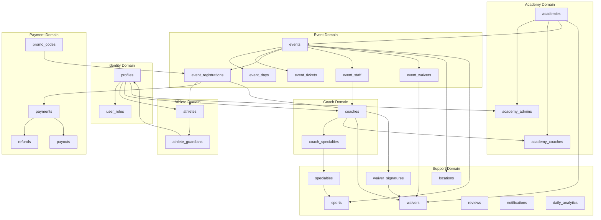

# Tenpo Database Schema Proposal

This document defines the database schema for Tenpo based on the scoping questions. It prioritizes a **simple, solid foundation** for the MVP (Events-only, Bay Area) while designing for future extensibility.

---

## 1. Feature-to-Table Mapping

| Feature | Tables Required | MVP? |
|---------|-----------------|------|
| User Authentication | `profiles` (extends Supabase auth.users) | Yes |
| Multi-Role Support | `user_roles` | Yes |
| Parent Accounts | `profiles` with PARENT role | Yes |
| Athlete Profiles | `athletes`, `athlete_guardians` | Yes |
| Coach Profiles | `coaches`, `coach_specialties` | Yes |
| Academy Management | `academies`, `academy_coaches`, `academy_admins` | Yes |
| Locations | `locations` | Yes |
| Events (Camps/Clinics) | `events`, `event_days`, `event_tickets`, `event_registrations` | Yes |
| Event Staffing | `event_staff` | Yes |
| Promo Codes | `promo_codes`, `promo_code_uses` | Yes |
| Payments | `payments` | Yes |
| Refunds | `refunds` | Yes |
| Reviews | `reviews` | Yes |
| Notifications | `notifications`, `notification_preferences` | Yes |
| Calendar Sync | `calendar_integrations` | Yes |
| Analytics | `daily_analytics`, `monthly_analytics` | Yes |
| Waivers | `waivers`, `event_waivers`, `waiver_signatures` | Yes |
| Sports/Specialties | `sports`, `specialties` | Yes |
| Individual Sessions | `sessions`, `session_participants`, `availability` | No (Future) |
| Bulk Packages | `packages`, `package_purchases` | No (Future) |
| Messaging | `conversations`, `messages` | No (Future) |

---

## 2. Table Descriptions

### 2.1 Core Identity Tables

#### `profiles`
**Purpose**: Extends Supabase `auth.users` with application-specific profile data. All users (parents, athletes, coaches, admins) have a profile.

| Column | Type | Nullable | Description |
|--------|------|----------|-------------|
| id | uuid | No | PK, references auth.users(id) |
| email | text | No | Synced from auth.users |
| first_name | text | Yes | Display name |
| last_name | text | Yes | Display name |
| phone_number | text | Yes | Required for booking; used for SMS later |
| avatar_url | text | Yes | Primary profile photo |
| timezone | text | Yes | User's preferred timezone |
| onboarding_completed | boolean | No | Default false; tracks onboarding flow |
| is_deleted | boolean | No | Default false; soft delete |
| created_at | timestamptz | No | Default now() |
| updated_at | timestamptz | No | Auto-updated |

**Why**: Supabase auth handles passwords, tokens, and verification. We only store profile data that the app needs.

---

#### `user_roles`
**Purpose**: Join table enabling multi-role support. A user can be both a Parent AND an Athlete, or an Academy Admin AND a Parent.

| Column | Type | Nullable | Description |
|--------|------|----------|-------------|
| id | uuid | No | PK |
| user_id | uuid | No | FK → profiles(id) |
| role | text | No | Enum: PARENT, ATHLETE, COACH, ACADEMY_ADMIN, SUPER_ADMIN, STAFF |
| is_primary | boolean | No | Default false; user's main role for UI |
| granted_at | timestamptz | No | When role was assigned |
| granted_by | uuid | Yes | FK → profiles(id); who granted this role |

**Why**: Tenpo needs multi-role support (Parent who is also an Athlete, Academy Admin who is also a Parent).

**Unique Constraint**: (user_id, role) - A user can't have the same role twice.

---

### 2.2 Athlete Tables

#### `athletes`
**Purpose**: Profile for anyone receiving training. Can be a youth managed by a parent OR an adult managing themselves.

| Column | Type | Nullable | Description |
|--------|------|----------|-------------|
| id | uuid | No | PK |
| user_id | uuid | Yes | FK → profiles(id); NULL in MVP (all parent-managed); Future: set for self-managed adults |
| first_name | text | No | Athlete's name |
| last_name | text | No | |
| birthdate | date | No | Used for age group filtering |
| skill_level | text | Yes | BEGINNER, INTERMEDIATE, ADVANCED |
| team | text | Yes | Current team/club name |
| allergies | text[] | Yes | Array of known allergens |
| medical_conditions | jsonb | Yes | {asthma: bool, other: string} |
| emergency_contact | jsonb | No | {first_name, last_name, phone, relationship} |
| is_deleted | boolean | No | Default false |
| created_at | timestamptz | No | |
| updated_at | timestamptz | No | |

**Why**: `user_id` can be NULL (parent-managed) or populated (self-managed adult). **In MVP, `user_id` is always NULL** — all athletes are managed by parents. Self-managed adult athletes are future functionality.

---

#### `athlete_guardians`
**Purpose**: Links athletes to their guardians (parents). Supports multiple guardians per athlete (divorced parents) and multiple athletes per guardian (siblings).

| Column | Type | Nullable | Description |
|--------|------|----------|-------------|
| id | uuid | No | PK |
| athlete_id | uuid | No | FK → athletes(id) |
| guardian_id | uuid | No | FK → profiles(id); must have PARENT role |
| relationship | text | Yes | 'mother', 'father', 'guardian', etc. |
| is_primary | boolean | No | Default false; primary contact |
| can_book | boolean | No | Default true; can book on behalf of athlete |
| created_at | timestamptz | No | |

**Why**: Tenpo needs many-to-many for divorced parents and multiple siblings.

---

### 2.3 Coach & Academy Tables

#### `coaches`
**Purpose**: Extended profile for users providing training services. Coaches can be independent or belong to academies (or both).

| Column | Type | Nullable | Description |
|--------|------|----------|-------------|
| id | uuid | No | PK |
| user_id | uuid | No | FK → profiles(id); must have COACH role |
| bio | text | Yes | Professional biography |
| experience_years | integer | Yes | Years of coaching experience |
| coaching_style | text | Yes | Description of approach |
| photos | text[] | Yes | Array of profile photo URLs |
| video_intro_url | text | Yes | Introduction video |
| price_per_hour | integer | Yes | Hourly rate in cents (for sessions, future) |
| session_duration_minutes | integer | Yes | Default session length |
| cancellation_hours | integer | No | Default 24; 12, 24, or 48 |
| travel_willing | boolean | No | Default false; willing to travel to client |
| virtual_available | boolean | No | Default false; offers online sessions |
| languages | text[] | Yes | Languages spoken |
| certifications | jsonb | Yes | Array of {name, issuer, year} |
| stripe_account_id | text | Yes | Stripe Connect account |
| stripe_onboarding_complete | boolean | No | Default false |
| is_verified | boolean | No | Default false; admin-verified badge |
| is_approved | boolean | No | Default false; Super Admin approval required |
| is_deleted | boolean | No | Default false |
| created_at | timestamptz | No | |
| updated_at | timestamptz | No | |

**Why**: Includes coaching_style, travel_willing, virtual_available, is_approved for Super Admin gating.

---

#### `academies`
**Purpose**: Represents a business/club that organizes events and employs coaches. NEW entity not in DivineTime.

| Column | Type | Nullable | Description |
|--------|------|----------|-------------|
| id | uuid | No | PK |
| name | text | No | Academy name |
| slug | text | No | URL-friendly unique identifier |
| description | text | Yes | About the academy |
| logo_url | text | Yes | Logo image |
| cover_image_url | text | Yes | Banner image |
| website | text | Yes | External website |
| email | text | Yes | Contact email |
| phone | text | Yes | Contact phone |
| stripe_account_id | text | Yes | Stripe Connect for payouts |
| stripe_onboarding_complete | boolean | No | Default false |
| is_verified | boolean | No | Default false; admin-verified badge |
| is_approved | boolean | No | Default false; Super Admin approval required |
| is_deleted | boolean | No | Default false |
| created_at | timestamptz | No | |
| updated_at | timestamptz | No | |

**Unique Constraint**: slug

**Why**: Tenpo's B2B component requires academies to manage their own events, coaches, and payments.

---

#### `academy_admins`
**Purpose**: Links users with ACADEMY_ADMIN role to the academies they manage.

| Column | Type | Nullable | Description |
|--------|------|----------|-------------|
| id | uuid | No | PK |
| academy_id | uuid | No | FK → academies(id) |
| user_id | uuid | No | FK → profiles(id) |
| role | text | No | 'owner', 'admin', 'manager' |
| created_at | timestamptz | No | |

**Unique Constraint**: (academy_id, user_id)

---

#### `academy_coaches`
**Purpose**: Many-to-many linking coaches to academies. A coach can belong to multiple academies or be fully independent.

| Column | Type | Nullable | Description |
|--------|------|----------|-------------|
| id | uuid | No | PK |
| academy_id | uuid | No | FK → academies(id) |
| coach_id | uuid | No | FK → coaches(id) |
| status | text | No | 'active', 'invited', 'inactive' |
| invited_at | timestamptz | Yes | When invitation sent |
| joined_at | timestamptz | Yes | When coach accepted |
| created_at | timestamptz | No | |

**Unique Constraint**: (academy_id, coach_id)

**Why**: Tenpo needs coaches linked to multiple academies.

---

### 2.4 Sports & Specialties

#### `sports`
**Purpose**: Lookup table for sports/disciplines. Initially just "Soccer" but designed for expansion.

| Column | Type | Nullable | Description |
|--------|------|----------|-------------|
| id | uuid | No | PK |
| name | text | No | e.g., "Soccer", "Basketball" |
| slug | text | No | URL-friendly identifier |
| icon_url | text | Yes | Sport icon |
| is_active | boolean | No | Default true |
| created_at | timestamptz | No | |

---

#### `specialties`
**Purpose**: Coaching specializations within a sport (e.g., "Goalkeeping", "Defense", "Finishing").

| Column | Type | Nullable | Description |
|--------|------|----------|-------------|
| id | uuid | No | PK |
| sport_id | uuid | No | FK → sports(id) |
| name | text | No | e.g., "Goalkeeping" |
| slug | text | No | |
| created_at | timestamptz | No | |

---

#### `coach_specialties`
**Purpose**: Many-to-many linking coaches to their specializations.

| Column | Type | Nullable | Description |
|--------|------|----------|-------------|
| coach_id | uuid | No | FK → coaches(id) |
| specialty_id | uuid | No | FK → specialties(id) |

**Composite PK**: (coach_id, specialty_id)

---

### 2.5 Location Tables

#### `locations`
**Purpose**: Physical venues for events and sessions. Enhanced from DivineTime's simple name-only table.

| Column | Type | Nullable | Description |
|--------|------|----------|-------------|
| id | uuid | No | PK |
| name | text | No | Location name |
| address_line1 | text | Yes | Street address |
| address_line2 | text | Yes | Unit, suite, etc. |
| city | text | Yes | |
| state | text | Yes | |
| postal_code | text | Yes | |
| country | text | Yes | Default 'US' |
| latitude | decimal(10,8) | Yes | GPS for map/distance |
| longitude | decimal(11,8) | Yes | |
| facility_type | text | Yes | 'field', 'gym', 'court', 'pool', 'other' |
| is_indoor | boolean | Yes | NULL = both/unknown |
| capacity | integer | Yes | Max participants |
| amenities | text[] | Yes | ['parking', 'restrooms', 'water', etc.] |
| photos | text[] | Yes | Array of photo URLs |
| timezone | text | Yes | IANA timezone (e.g., 'America/Los_Angeles') |
| created_by | uuid | Yes | FK → profiles(id) |
| is_deleted | boolean | No | Default false |
| created_at | timestamptz | No | |
| updated_at | timestamptz | No | |

**Why**: Tenpo needs full address for maps/directions, facility details for filtering, and timezone for proper event time display.

---

### 2.6 Event Tables

#### `events`
**Purpose**: Camps and clinics organized by academies. Core of the MVP.

| Column | Type | Nullable | Description |
|--------|------|----------|-------------|
| id | uuid | No | PK |
| academy_id | uuid | No | FK → academies(id) |
| sport_id | uuid | No | FK → sports(id) |
| location_id | uuid | Yes | FK → locations(id); NULL if virtual |
| title | text | No | Event name |
| slug | text | No | URL-friendly, unique per academy |
| description | text | Yes | Full description (markdown) |
| event_type | text | No | 'CAMP' or 'CLINIC' |
| image_url | text | Yes | Cover image |
| min_age | integer | Yes | Minimum participant age |
| max_age | integer | Yes | Maximum participant age |
| max_capacity | integer | Yes | Total headcount limit |
| skill_levels | text[] | Yes | ['BEGINNER', 'INTERMEDIATE', 'ADVANCED'] |
| is_virtual | boolean | No | Default false |
| registration_opens_at | timestamptz | Yes | When registration opens |
| registration_closes_at | timestamptz | Yes | Deadline for registration |
| cancellation_policy_hours | integer | No | Default 48 |
| status | text | No | 'draft', 'published', 'canceled', 'completed' |
| is_deleted | boolean | No | Default false |
| created_at | timestamptz | No | |
| updated_at | timestamptz | No | |

**Unique Constraint**: (academy_id, slug)

---

#### `event_days`
**Purpose**: Individual days within an event. Supports multi-day camps with different schedules per day.

| Column | Type | Nullable | Description |
|--------|------|----------|-------------|
| id | uuid | No | PK |
| event_id | uuid | No | FK → events(id) |
| date | date | No | The specific date |
| start_time | time | No | Start time for this day |
| end_time | time | No | End time for this day |
| notes | text | Yes | Day-specific notes |
| created_at | timestamptz | No | |

**Why**: Tenpo needs multi-day support with different schedules.

---

#### `event_tickets`
**Purpose**: Ticket tiers for an event (Early Bird, Standard, VIP, etc.).

| Column | Type | Nullable | Description |
|--------|------|----------|-------------|
| id | uuid | No | PK |
| event_id | uuid | No | FK → events(id) |
| name | text | No | Ticket type name |
| description | text | Yes | What's included |
| price | integer | No | Price in cents |
| capacity | integer | Yes | NULL = unlimited for this tier |
| quantity_sold | integer | No | Default 0; denormalized counter |
| min_age | integer | Yes | Age restriction for this tier |
| max_age | integer | Yes | |
| sales_start_at | timestamptz | Yes | When this tier goes on sale |
| sales_end_at | timestamptz | Yes | When sales close |
| is_deleted | boolean | No | Default false |
| created_at | timestamptz | No | |
| updated_at | timestamptz | No | |

---

#### `event_registrations`
**Purpose**: Records an athlete's registration for an event.

| Column | Type | Nullable | Description |
|--------|------|----------|-------------|
| id | uuid | No | PK |
| event_id | uuid | No | FK → events(id) |
| event_ticket_id | uuid | No | FK → event_tickets(id) |
| athlete_id | uuid | No | FK → athletes(id) |
| registered_by | uuid | No | FK → profiles(id); parent or self |
| payment_id | uuid | Yes | FK → payments(id) |
| status | text | No | 'pending', 'confirmed', 'canceled', 'refunded' |
| waiver_signed | boolean | No | Default false |
| notes | text | Yes | Special requests |
| created_at | timestamptz | No | |
| updated_at | timestamptz | No | |

**Unique Constraint**: (event_id, athlete_id) - Athlete can only register once per event

---

#### `event_staff`
**Purpose**: Coaches assigned to work an event.

| Column | Type | Nullable | Description |
|--------|------|----------|-------------|
| id | uuid | No | PK |
| event_id | uuid | No | FK → events(id) |
| coach_id | uuid | Yes | FK → coaches(id); NULL if external |
| external_name | text | Yes | Name if not a platform coach |
| external_email | text | Yes | Contact if not a platform coach |
| role | text | Yes | 'lead', 'assistant', 'volunteer' |
| status | text | No | 'invited', 'confirmed', 'declined' |
| created_at | timestamptz | No | |

**Why**: Supports both platform coaches and external staff (non-platform trainers).

---

### 2.7 Promo Codes

#### `promo_codes`
**Purpose**: Discount codes for events.

| Column | Type | Nullable | Description |
|--------|------|----------|-------------|
| id | uuid | No | PK |
| code | text | No | The code users enter (uppercase) |
| academy_id | uuid | Yes | FK → academies(id); NULL = platform-wide |
| event_id | uuid | Yes | FK → events(id); NULL = all academy events |
| discount_type | text | No | 'percentage' or 'fixed' |
| discount_value | integer | No | Percentage (10 = 10%) or cents |
| max_uses | integer | Yes | NULL = unlimited |
| times_used | integer | No | Default 0 |
| valid_from | timestamptz | Yes | |
| valid_until | timestamptz | Yes | |
| is_active | boolean | No | Default true |
| created_at | timestamptz | No | |

**Unique Constraint**: code (case-insensitive)

---

#### `promo_code_uses`
**Purpose**: Tracks individual uses of promo codes.

| Column | Type | Nullable | Description |
|--------|------|----------|-------------|
| id | uuid | No | PK |
| promo_code_id | uuid | No | FK → promo_codes(id) |
| user_id | uuid | No | FK → profiles(id) |
| registration_id | uuid | No | FK → event_registrations(id) |
| discount_applied | integer | No | Actual discount in cents |
| created_at | timestamptz | No | |

---

### 2.8 Payment Tables

#### `payments`
**Purpose**: Records all payments made on the platform.

| Column | Type | Nullable | Description |
|--------|------|----------|-------------|
| id | uuid | No | PK |
| user_id | uuid | No | FK → profiles(id); who paid |
| academy_id | uuid | Yes | FK → academies(id); recipient |
| event_id | uuid | Yes | FK → events(id) |
| stripe_payment_intent_id | text | No | Stripe reference |
| stripe_customer_id | text | Yes | Stripe customer |
| amount | integer | No | Total in cents |
| platform_fee | integer | No | Tenpo's cut in cents |
| currency | text | No | Default 'usd' |
| status | text | No | 'pending', 'succeeded', 'failed', 'refunded' |
| payment_method | text | Yes | 'card', 'bank', etc. |
| receipt_email | text | Yes | |
| metadata | jsonb | Yes | Additional context |
| created_at | timestamptz | No | |
| updated_at | timestamptz | No | |

---

#### `refunds`
**Purpose**: Tracks refund requests and processing.

| Column | Type | Nullable | Description |
|--------|------|----------|-------------|
| id | uuid | No | PK |
| payment_id | uuid | No | FK → payments(id) |
| registration_id | uuid | Yes | FK → event_registrations(id) |
| stripe_refund_id | text | Yes | Stripe reference |
| amount | integer | No | Refund amount in cents |
| reason | text | Yes | Why refund was requested |
| status | text | No | 'pending', 'approved', 'rejected', 'completed' |
| requested_by | uuid | No | FK → profiles(id) |
| processed_by | uuid | Yes | FK → profiles(id); admin who processed |
| processed_at | timestamptz | Yes | |
| created_at | timestamptz | No | |

---

#### `payouts`
**Purpose**: Tracks payouts to academies/coaches via Stripe Connect.

| Column | Type | Nullable | Description |
|--------|------|----------|-------------|
| id | uuid | No | PK |
| academy_id | uuid | Yes | FK → academies(id) |
| coach_id | uuid | Yes | FK → coaches(id) |
| stripe_transfer_id | text | No | Stripe reference |
| amount | integer | No | Payout in cents |
| currency | text | No | Default 'usd' |
| status | text | No | 'pending', 'in_transit', 'paid', 'failed' |
| created_at | timestamptz | No | |
| updated_at | timestamptz | No | |

---

### 2.9 Review Tables

#### `reviews`
**Purpose**: Bidirectional reviews. Parents review coaches/academies (public). Coaches review parents/athletes (private).

| Column | Type | Nullable | Description |
|--------|------|----------|-------------|
| id | uuid | No | PK |
| reviewer_id | uuid | No | FK → profiles(id) |
| event_id | uuid | Yes | FK → events(id); what was reviewed |
| registration_id | uuid | Yes | FK → event_registrations(id) |
| reviewee_type | text | No | 'coach', 'academy', 'athlete', 'parent' |
| reviewee_id | uuid | No | ID of coach/academy/athlete/parent |
| rating | integer | No | 1-5 stars |
| comment | text | Yes | Written review |
| is_public | boolean | No | True for coach/academy reviews, false for parent/athlete |
| status | text | No | 'published', 'disputed', 'removed' |
| created_at | timestamptz | No | |
| updated_at | timestamptz | No | |

**Why**: Tenpo needs coaches to flag problematic clients (no-shows) privately.

---

### 2.10 Notification Tables

#### `notifications`
**Purpose**: Stores notifications sent to users.

| Column | Type | Nullable | Description |
|--------|------|----------|-------------|
| id | uuid | No | PK |
| user_id | uuid | No | FK → profiles(id) |
| type | text | No | 'booking_confirmed', 'event_reminder', 'review_received', etc. |
| title | text | No | Notification title |
| body | text | Yes | Notification content |
| data | jsonb | Yes | Structured data (event_id, etc.) |
| channel | text | No | 'email', 'push', 'sms' |
| status | text | No | 'pending', 'sent', 'failed' |
| sent_at | timestamptz | Yes | |
| read_at | timestamptz | Yes | |
| created_at | timestamptz | No | |

---

#### `notification_preferences`
**Purpose**: User preferences for notification types and channels.

| Column | Type | Nullable | Description |
|--------|------|----------|-------------|
| id | uuid | No | PK |
| user_id | uuid | No | FK → profiles(id) |
| notification_type | text | No | 'booking_confirmed', 'event_reminder', etc. |
| email_enabled | boolean | No | Default true |
| push_enabled | boolean | No | Default true |
| sms_enabled | boolean | No | Default false |
| updated_at | timestamptz | No | |

**Unique Constraint**: (user_id, notification_type)

---

### 2.11 Waiver Tables

#### `waivers`
**Purpose**: Waiver/liability agreement templates. Can be defined at platform level, academy level, or coach level (for independent coaches).

| Column | Type | Nullable | Description |
|--------|------|----------|-------------|
| id | uuid | No | PK |
| academy_id | uuid | Yes | FK → academies(id); NULL if platform-wide or coach-owned |
| coach_id | uuid | Yes | FK → coaches(id); NULL if platform-wide or academy-owned |
| name | text | No | Waiver name |
| content | text | No | Full text (markdown) |
| version | integer | No | Default 1; increment on changes |
| is_active | boolean | No | Default true |
| created_at | timestamptz | No | |
| updated_at | timestamptz | No | |

**Note**: Exactly one of `academy_id`, `coach_id` should be set, OR both NULL for platform-wide waivers.

---

#### `event_waivers`
**Purpose**: Junction table linking events to required waivers. Allows events to require multiple waivers (e.g., liability + photo release).

| Column | Type | Nullable | Description |
|--------|------|----------|-------------|
| id | uuid | No | PK |
| event_id | uuid | No | FK → events(id) |
| waiver_id | uuid | No | FK → waivers(id) |
| is_required | boolean | No | Default true; false = optional |
| created_at | timestamptz | No | |

**Unique Constraint**: (event_id, waiver_id)

**Why**: Enables flexible waiver requirements per event. An academy might have a standard liability waiver plus an event-specific photo release waiver.

---

#### `waiver_signatures`
**Purpose**: Records of signed waivers.

| Column | Type | Nullable | Description |
|--------|------|----------|-------------|
| id | uuid | No | PK |
| waiver_id | uuid | No | FK → waivers(id) |
| athlete_id | uuid | No | FK → athletes(id) |
| signed_by | uuid | No | FK → profiles(id); parent or adult athlete |
| event_id | uuid | Yes | FK → events(id); if event-specific |
| ip_address | text | Yes | Signer's IP |
| user_agent | text | Yes | Browser info |
| signature_method | text | No | 'checkbox' or 'document' |
| document_url | text | Yes | If uploaded document |
| signed_at | timestamptz | No | |

---

### 2.12 Calendar Integration

#### `calendar_integrations`
**Purpose**: OAuth tokens for Google/Apple/Outlook calendar sync.

| Column | Type | Nullable | Description |
|--------|------|----------|-------------|
| id | uuid | No | PK |
| user_id | uuid | No | FK → profiles(id) |
| provider | text | No | 'google', 'apple', 'outlook' |
| email | text | Yes | Calendar account email |
| access_token | text | No | Encrypted OAuth token |
| refresh_token | text | Yes | Encrypted refresh token |
| expires_at | timestamptz | Yes | Token expiration |
| is_active | boolean | No | Default true |
| created_at | timestamptz | No | |
| updated_at | timestamptz | No | |

**Unique Constraint**: (user_id, provider)

---

### 2.13 Analytics Tables

#### `daily_analytics`
**Purpose**: Daily aggregated metrics computed nightly.

| Column | Type | Nullable | Description |
|--------|------|----------|-------------|
| id | uuid | No | PK |
| date | date | No | The date |
| scope_type | text | No | 'platform', 'academy', 'coach' |
| scope_id | uuid | Yes | academy_id or coach_id; NULL for platform |
| new_users | integer | No | Default 0 |
| active_users | integer | No | Default 0 |
| new_registrations | integer | No | Default 0 |
| revenue | integer | No | In cents |
| refunds | integer | No | In cents |
| events_created | integer | No | Default 0 |
| reviews_received | integer | No | Default 0 |
| average_rating | decimal(3,2) | Yes | |
| created_at | timestamptz | No | |

**Unique Constraint**: (date, scope_type, scope_id)

---

#### `monthly_analytics`
**Purpose**: Monthly rollups of daily analytics.

| Column | Type | Nullable | Description |
|--------|------|----------|-------------|
| id | uuid | No | PK |
| year | integer | No | |
| month | integer | No | 1-12 |
| scope_type | text | No | 'platform', 'academy', 'coach' |
| scope_id | uuid | Yes | |
| total_users | integer | No | |
| new_users | integer | No | |
| active_users | integer | No | |
| total_registrations | integer | No | |
| total_revenue | integer | No | In cents |
| total_refunds | integer | No | In cents |
| total_events | integer | No | |
| completed_events | integer | No | |
| canceled_events | integer | No | |
| average_rating | decimal(3,2) | Yes | |
| created_at | timestamptz | No | |

**Unique Constraint**: (year, month, scope_type, scope_id)

---

### 2.14 Future Tables (Not in MVP)

These tables are designed but not implemented in MVP:

#### `availability` (Future)
Coach availability windows for individual sessions.

#### `sessions` (Future)
Individual 1-on-1 or small group training sessions.

#### `session_participants` (Future)
Athletes in a group session.

#### `packages` (Future)
Bulk session packages (10 sessions for $X).

#### `package_purchases` (Future)
User purchases of bulk packages.

#### `conversations` (Future)
Parent-coach messaging threads.

#### `messages` (Future)
Individual messages in conversations.

---

## 3. Core Business Flows

### 3.1 User Registration & Onboarding Flow

**Guest Browsing & Late Account Creation**: Users can browse events, view details, and add items to checkout without creating an account. Account creation happens at checkout time when payment is required. This "guest-to-checkout" flow creates the `profiles` record via Supabase Auth (email or Google) just before payment processing.

**For Parents (MVP)**: After account creation at checkout, they are prompted to complete their profile (name, phone) and add athlete information for the child being registered. Each athlete gets a row in `athletes` with `user_id = NULL` (parent-managed), and a link in `athlete_guardians` connecting the parent. The `athlete_guardians` table supports **many-to-many relationships**: one athlete can have multiple guardians (e.g., divorced parents both booking), and one parent can manage multiple athletes (siblings).

> **Note**: In MVP, all athletes are parent-managed. Self-managed adult athletes (`athletes.user_id` populated) is future functionality.

**For Coaches (Invited by Academy Admin)**: When an Academy Admin invites a coach via a unique link, they click through to create their account. Upon completing the `coaches` profile (bio, experience, certifications, Stripe Connect), they are **automatically approved** (`is_approved = true`) since the Academy Admin vouches for them. An `academy_coaches` record links them to the inviting academy with status 'active'.

**For Coaches (Self-Signup)**: When a coach signs up independently (not via invite link), they complete the same onboarding flow but their profile remains `is_approved = false` until a **Super Admin reviews and approves them**. They can also select specialties from the `specialties` table. Self-signup coaches are independent until they join academies.

**For Academy Admins**: They create an `academies` record and complete Stripe Connect onboarding. An `academy_admins` row links them to the academy. They remain `is_approved = false` until Super Admin review. Once approved, Academy Admins can invite coaches (creating `academy_coaches` rows with status 'invited') or accept coach requests to join.

---

### 3.2 Event Creation & Publishing Flow

An Academy Admin creates an event by populating the `events` table with details: title, description, type (CAMP or CLINIC), location, age range, and capacity. They then add individual days via `event_days` specifying the schedule for each day of a multi-day camp.

Next, they create ticket tiers in `event_tickets`: perhaps "Early Bird" at $150 available until a certain date, and "Standard" at $200 afterward. Each tier can have its own capacity limit and age restrictions.

The admin can optionally create `promo_codes` for discounts (e.g., "SUMMER20" for 20% off). They assign coaches to staff the event via `event_staff`, either selecting platform coaches or entering external staff details.

Finally, they set the event status to 'published', making it visible to parents. The event appears in search results filtered by sport, location, age group, and dates.

---

### 3.3 Event Registration & Payment Flow

A Parent discovers an event and clicks to register their athlete. The system checks age eligibility against `events.min_age/max_age` and the athlete's birthdate. If the event requires a waiver, the parent must sign (creating a `waiver_signatures` record).

The parent selects a ticket tier from `event_tickets` and optionally applies a promo code. The system validates the code against `promo_codes` (checking validity dates, usage limits) and calculates the final price.

Payment is collected via Stripe. Upon successful payment, a `payments` record is created with the Stripe payment intent ID. The `event_registrations` record is created with status 'confirmed', linking the athlete, event, ticket tier, and payment.

A confirmation notification is sent via `notifications`, and the event is optionally added to the parent's calendar via `calendar_integrations`. The `event_tickets.quantity_sold` counter is incremented.

The academy receives funds via Stripe Connect after the platform fee is deducted. A `payouts` record tracks the transfer.

---

### 3.4 Cancellation & Refund Flow

A Parent requests cancellation on an `event_registrations` record. The system checks the event's `cancellation_policy_hours` against the current time.

If within the cancellation window, the refund is **automatically approved**. A `refunds` record is created with status 'approved', the Stripe refund is processed, and the registration status changes to 'refunded'. The `event_tickets.quantity_sold` is decremented.

If outside the window, the refund request goes to status 'pending' and alerts are sent to the Academy Admin and Super Admins via `notifications`. Super Admins can override and approve/reject the refund regardless of policy.

A dispute flow exists where parents can submit a form that sends emails to Super Admins and respective academy admin for manual resolution.

---

### 3.5 Review Flow

After an event completes, both parties can leave reviews. Parents leave **public** reviews on coaches and academies, visible to other users. These reviews appear on coach/academy profiles and affect their average rating.

Coaches can leave **private** reviews on athletes/parents, primarily to flag problematic behavior (no-shows, difficult clients). These are only visible to Super Admins and help identify patterns.

Reviews require at least one completed registration (`event_registrations` with status 'confirmed' or 'completed'). Academy Admins and Coaches can dispute reviews by changing status to 'disputed', alerting Super Admins for review. Super Admins can remove reviews by setting status to 'removed'.

---

### 3.6 Analytics Computation Flow

A nightly batch job computes `daily_analytics` for the previous day. It aggregates data at three scopes:
- **Platform-wide** (scope_type = 'platform', scope_id = NULL): Total new users, registrations, revenue
- **Per-Academy** (scope_type = 'academy'): Academy-specific metrics
- **Per-Coach** (scope_type = 'coach'): Coach-specific metrics (future, when sessions exist)

Monthly rollups aggregate daily data into `monthly_analytics`. Dashboards query these pre-computed tables for fast loading rather than calculating on-demand.

---

## 4. Entity Relationship Diagrams

### 4.1 High-Level Domain Diagram

### 4.2 Detailed ER Diagram

```mermaid
erDiagram
    %% ===== IDENTITY =====
    profiles {
        uuid id PK
        text email UK
        text first_name
        text last_name
        text phone_number
        text avatar_url
        text timezone
        boolean onboarding_completed
        boolean is_deleted
        timestamptz created_at
        timestamptz updated_at
    }

    user_roles {
        uuid id PK
        uuid user_id FK
        text role
        boolean is_primary
        timestamptz granted_at
        uuid granted_by FK
    }

    %% ===== ATHLETES =====
    athletes {
        uuid id PK
        uuid user_id FK
        text first_name
        text last_name
        date birthdate
        text skill_level
        text team
        text[] allergies
        jsonb medical_conditions
        jsonb emergency_contact
        boolean is_deleted
    }

    athlete_guardians {
        uuid id PK
        uuid athlete_id FK
        uuid guardian_id FK
        text relationship
        boolean is_primary
        boolean can_book
    }

    %% ===== COACHES =====
    coaches {
        uuid id PK
        uuid user_id FK
        text bio
        integer experience_years
        text coaching_style
        text[] photos
        text video_intro_url
        integer price_per_hour
        integer session_duration_minutes
        integer cancellation_hours
        boolean travel_willing
        boolean virtual_available
        text[] languages
        jsonb certifications
        text stripe_account_id
        boolean stripe_onboarding_complete
        boolean is_verified
        boolean is_approved
        boolean is_deleted
    }

    coach_specialties {
        uuid coach_id PK,FK
        uuid specialty_id PK,FK
    }

    %% ===== ACADEMIES =====
    academies {
        uuid id PK
        text name
        text slug UK
        text description
        text logo_url
        text cover_image_url
        text website
        text email
        text phone
        text stripe_account_id
        boolean stripe_onboarding_complete
        boolean is_verified
        boolean is_approved
        boolean is_deleted
    }

    academy_admins {
        uuid id PK
        uuid academy_id FK
        uuid user_id FK
        text role
    }

    academy_coaches {
        uuid id PK
        uuid academy_id FK
        uuid coach_id FK
        text status
        timestamptz invited_at
        timestamptz joined_at
    }

    %% ===== SPORTS =====
    sports {
        uuid id PK
        text name
        text slug UK
        text icon_url
        boolean is_active
    }

    specialties {
        uuid id PK
        uuid sport_id FK
        text name
        text slug
    }

    %% ===== LOCATIONS =====
    locations {
        uuid id PK
        text name
        text address_line1
        text city
        text state
        text postal_code
        decimal latitude
        decimal longitude
        text facility_type
        boolean is_indoor
        integer capacity
        text[] amenities
        text[] photos
        text timezone
        uuid created_by FK
        boolean is_deleted
    }

    %% ===== EVENTS =====
    events {
        uuid id PK
        uuid academy_id FK
        uuid sport_id FK
        uuid location_id FK
        text title
        text slug
        text description
        text event_type
        text image_url
        integer min_age
        integer max_age
        integer max_capacity
        text[] skill_levels
        boolean is_virtual
        timestamptz registration_opens_at
        timestamptz registration_closes_at
        integer cancellation_policy_hours
        text status
        boolean is_deleted
    }

    event_days {
        uuid id PK
        uuid event_id FK
        date date
        time start_time
        time end_time
        text notes
    }

    event_tickets {
        uuid id PK
        uuid event_id FK
        text name
        text description
        integer price
        integer capacity
        integer quantity_sold
        integer min_age
        integer max_age
        timestamptz sales_start_at
        timestamptz sales_end_at
        boolean is_deleted
    }

    event_registrations {
        uuid id PK
        uuid event_id FK
        uuid event_ticket_id FK
        uuid athlete_id FK
        uuid registered_by FK
        uuid payment_id FK
        text status
        boolean waiver_signed
        text notes
    }

    event_staff {
        uuid id PK
        uuid event_id FK
        uuid coach_id FK
        text external_name
        text external_email
        text role
        text status
    }

    %% ===== PROMO CODES =====
    promo_codes {
        uuid id PK
        text code UK
        uuid academy_id FK
        uuid event_id FK
        text discount_type
        integer discount_value
        integer max_uses
        integer times_used
        timestamptz valid_from
        timestamptz valid_until
        boolean is_active
    }

    promo_code_uses {
        uuid id PK
        uuid promo_code_id FK
        uuid user_id FK
        uuid registration_id FK
        integer discount_applied
    }

    %% ===== PAYMENTS =====
    payments {
        uuid id PK
        uuid user_id FK
        uuid academy_id FK
        uuid event_id FK
        text stripe_payment_intent_id
        text stripe_customer_id
        integer amount
        integer platform_fee
        text currency
        text status
        text payment_method
        text receipt_email
        jsonb metadata
    }

    refunds {
        uuid id PK
        uuid payment_id FK
        uuid registration_id FK
        text stripe_refund_id
        integer amount
        text reason
        text status
        uuid requested_by FK
        uuid processed_by FK
        timestamptz processed_at
    }

    payouts {
        uuid id PK
        uuid academy_id FK
        uuid coach_id FK
        text stripe_transfer_id
        integer amount
        text currency
        text status
    }

    %% ===== REVIEWS =====
    reviews {
        uuid id PK
        uuid reviewer_id FK
        uuid event_id FK
        uuid registration_id FK
        text reviewee_type
        uuid reviewee_id
        integer rating
        text comment
        boolean is_public
        text status
    }

    %% ===== WAIVERS =====
    waivers {
        uuid id PK
        uuid academy_id FK
        uuid coach_id FK
        text name
        text content
        integer version
        boolean is_active
    }

    event_waivers {
        uuid id PK
        uuid event_id FK
        uuid waiver_id FK
        boolean is_required
    }

    waiver_signatures {
        uuid id PK
        uuid waiver_id FK
        uuid athlete_id FK
        uuid signed_by FK
        uuid event_id FK
        text ip_address
        text signature_method
        text document_url
        timestamptz signed_at
    }

    %% ===== NOTIFICATIONS =====
    notifications {
        uuid id PK
        uuid user_id FK
        text type
        text title
        text body
        jsonb data
        text channel
        text status
        timestamptz sent_at
        timestamptz read_at
    }

    notification_preferences {
        uuid id PK
        uuid user_id FK
        text notification_type
        boolean email_enabled
        boolean push_enabled
        boolean sms_enabled
    }

    %% ===== CALENDAR =====
    calendar_integrations {
        uuid id PK
        uuid user_id FK
        text provider
        text email
        text access_token
        text refresh_token
        timestamptz expires_at
        boolean is_active
    }

    %% ===== ANALYTICS =====
    daily_analytics {
        uuid id PK
        date date
        text scope_type
        uuid scope_id
        integer new_users
        integer active_users
        integer new_registrations
        integer revenue
        integer refunds
        integer events_created
        integer reviews_received
        decimal average_rating
    }

    monthly_analytics {
        uuid id PK
        integer year
        integer month
        text scope_type
        uuid scope_id
        integer total_users
        integer new_users
        integer total_registrations
        integer total_revenue
        integer total_events
        decimal average_rating
    }

    %% ===== RELATIONSHIPS =====

    profiles ||--o{ user_roles : "has"
    profiles ||--o| coaches : "is"
    profiles ||--o{ athlete_guardians : "guardian of"
    profiles ||--o{ academy_admins : "administers"
    profiles ||--o{ notifications : "receives"
    profiles ||--o| notification_preferences : "configures"
    profiles ||--o{ calendar_integrations : "syncs"
    profiles ||--o{ payments : "makes"
    profiles ||--o{ reviews : "writes"

    athletes ||--o{ athlete_guardians : "has guardians"
    athletes }o--o| profiles : "self-managed"
    athletes ||--o{ event_registrations : "registers"
    athletes ||--o{ waiver_signatures : "signs"

    coaches ||--o{ coach_specialties : "has"
    coaches ||--o{ academy_coaches : "belongs to"
    coaches ||--o{ event_staff : "staffs"
    coaches ||--o{ payouts : "receives"
    coaches ||--o{ waivers : "defines"

    academies ||--o{ academy_admins : "managed by"
    academies ||--o{ academy_coaches : "employs"
    academies ||--o{ events : "organizes"
    academies ||--o{ promo_codes : "creates"
    academies ||--o{ waivers : "defines"
    academies ||--o{ payouts : "receives"

    sports ||--o{ specialties : "has"
    sports ||--o{ events : "for"
    specialties ||--o{ coach_specialties : "assigned"

    locations ||--o{ events : "hosts"

    events ||--o{ event_days : "spans"
    events ||--o{ event_tickets : "sells"
    events ||--o{ event_registrations : "receives"
    events ||--o{ event_staff : "staffed by"
    events ||--o{ promo_codes : "discounted by"
    events ||--o{ event_waivers : "requires"
    events ||--o{ waiver_signatures : "collects"
    events ||--o{ reviews : "reviewed"

    event_waivers }o--|| waivers : "references"

    event_tickets ||--o{ event_registrations : "purchased"

    event_registrations ||--o| payments : "paid by"
    event_registrations ||--o{ promo_code_uses : "discounted"
    event_registrations ||--o{ refunds : "refunded"

    promo_codes ||--o{ promo_code_uses : "used"

    payments ||--o{ refunds : "refunded"

    waivers ||--o{ waiver_signatures : "signed"
```

---

## 5. Key Differences from DivineTime

| Aspect | DivineTime | Tenpo |
|--------|------------|-------|
| Terminology | Child, Trainer | Athlete, Coach |
| Academies | Not a concept | First-class entity |
| User Roles | Single role per user | Multi-role support |
| Self-booking Adults | No | Yes (Athlete with user_id) |
| Multiple Guardians | No | Yes (athlete_guardians) |
| Coach-Academy | Trainers independent | Coaches can belong to multiple academies |
| Auth | Custom password/OTP | Supabase (no password tables) |
| Locations | Name only | Full address, GPS, amenities |
| Events | Has sessions in MVP | MVP is events-only |
| Subscriptions | BASIC/FREE | Not in MVP |
| Event Staffing | EventTrainer only | Supports external non-platform staff |
| Reviews | One-way | Bidirectional (public + private) |
| Promo Codes | Not present | Supported |
| Soft Deletes | Some tables | All tables |
| Analytics Scope | Platform only | Platform, Academy, and Coach level |

---

## 6. MVP Table Checklist

| Table | MVP? | Notes |
|-------|------|-------|
| profiles | Yes | Core |
| user_roles | Yes | Multi-role support |
| athletes | Yes | Core |
| athlete_guardians | Yes | Multiple guardians |
| coaches | Yes | Even if sessions not in MVP, needed for event staff |
| coach_specialties | Yes | |
| academies | Yes | Core for events |
| academy_admins | Yes | |
| academy_coaches | Yes | |
| sports | Yes | Start with Soccer |
| specialties | Yes | |
| locations | Yes | |
| events | Yes | Core MVP |
| event_days | Yes | Multi-day support |
| event_tickets | Yes | |
| event_registrations | Yes | |
| event_staff | Yes | |
| event_waivers | Yes | Links events to required waivers |
| promo_codes | Yes | |
| promo_code_uses | Yes | |
| payments | Yes | |
| refunds | Yes | |
| payouts | Yes | |
| reviews | Yes | |
| waivers | Yes | |
| waiver_signatures | Yes | |
| notifications | Yes | |
| notification_preferences | Yes | |
| calendar_integrations | Yes | |
| daily_analytics | Yes | |
| monthly_analytics | Yes | |

**NOT in MVP:**
- availability
- sessions
- session_participants
- packages
- package_purchases
- conversations
- messages

---

*Document Version: 1.3*
*Created: Based on scoping-questions.md responses*

**Changelog:**
- v1.3: Waiver system enhancements:
  - Added `coach_id` to `waivers` table (solo coaches can define their own waivers)
  - Created `event_waivers` junction table (events can require multiple waivers)
  - Updated high-level flowchart: added `EW[event_waivers]`, `AC --> W`, `C --> W`, `E --> EW`
  - Updated detailed ER diagram with new table and relationships
- v1.2: Rewrote section 3.1 to reflect:
  - Guest browsing → checkout → account creation flow (not signup-first)
  - Clarified athlete_guardians is many-to-many (multiple guardians per athlete, multiple athletes per guardian)
  - MVP: All athletes are parent-managed (self-managed adults is future)
  - Coach invite flow: auto-approved by academy admin vouching
  - Coach self-signup: requires Super Admin approval
- v1.1: Added `timezone` to locations table (Q117), added `photos text[]` to coaches table (Q15)
